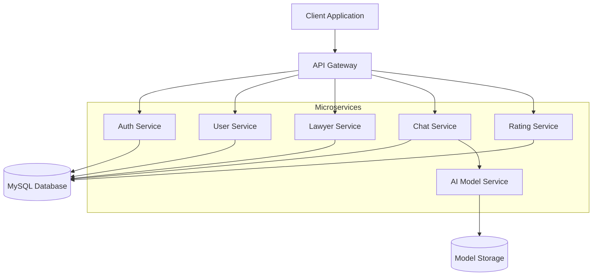

# Cameroon Legal Assistant Architecture

## Functional Requirements

1. User Authentication & Authorization
   - Email/password registration and login
   - Two-factor authentication (Email/SMS)
   - User profile management
   - Role-based access control (Users, Lawyers, Admins)

2. AI Legal Assistant
   - Natural language query processing
   - Context-aware responses
   - Legal document analysis
   - Multilingual support (English/French)
   - Chat history tracking

3. Lawyer Directory
   - Lawyer profiles with detailed information
   - Search and filter functionality
   - Rating and review system
   - Lawyer application process
   - Profile verification system

4. Chat System
   - Real-time messaging
   - File attachment support
   - Chat history
   - AI-powered responses
   - Export chat logs

## Non-Functional Requirements

1. Performance
   - Page load time < 2 seconds
   - API response time < 500ms
   - Support 10,000+ concurrent users
   - 99.9% uptime

2. Security
   - End-to-end encryption for messages
   - Secure data storage
   - Regular security audits
   - GDPR compliance
   - Data backup and recovery

3. Scalability
   - Horizontal scaling capability
   - Load balancing
   - Caching strategy
   - Database sharding

4. Usability
   - Mobile-responsive design
   - Offline capability
   - Accessibility compliance
   - Multi-language support

## Product Backlog

### Sprint 1: Foundation
- [x] Project setup with React and TypeScript
- [x] Basic UI components
- [x] Authentication system
- [x] Database schema

### Sprint 2: Core Features
- [x] AI integration
- [x] Chat interface
- [x] Lawyer directory
- [x] Rating system

### Sprint 3: Enhanced Security
- [ ] Two-factor authentication
- [ ] End-to-end encryption
- [ ] Role-based access control
- [ ] Security audit

### Sprint 4: Advanced Features
- [ ] Document analysis
- [ ] Multi-language support
- [ ] Advanced search
- [ ] Analytics dashboard

### Sprint 5: Performance & Scale
- [ ] Performance optimization
- [ ] Caching implementation
- [ ] Load balancing
- [ ] Monitoring system

## Architecture Diagram



## AI Model Integration

To integrate your trained model:

1. Place your model files in the `ai-model` directory:
```
ai-model/
  ├── models/          # Trained model files
  ├── src/            # Model serving code
  ├── requirements.txt # Python dependencies
  └── Dockerfile      # Container configuration
```

2. Update the model endpoint in `.env`:
```
VITE_AI_MODEL_ENDPOINT=http://localhost:5000/predict
```

3. Implement the prediction endpoint in your model server:
```python
from flask import Flask, request, jsonify

app = Flask(__name__)

@app.route('/predict', methods=['POST'])
def predict():
    data = request.json
    query = data['query']
    # Add your model inference code here
    response = your_model.predict(query)
    return jsonify({'response': response})

if __name__ == '__main__':
    app.run(host='0.0.0.0', port=5000)
```

4. Build and run the Docker container:
```bash
docker-compose up -d ai-model
```